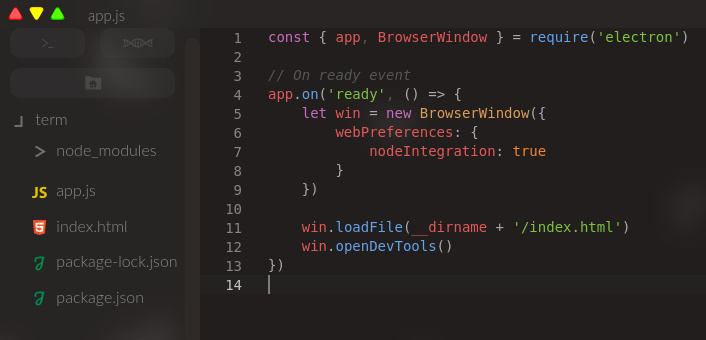

<div align="center">
    
</div>

# Illiade

> Current stable version: Illiade Pillar

The official Phoenix Arts IDE.
Download newest release [here](https://github.com/Ph0enixKM/Illiade/releases/latest)
Once installed you can run the executable
or if you have **Ubuntu | Debian | Lava** operating system
you can easily run it with `illiade` or shortname `illi`

## Instalation (MacOS)

Download *Illiade-MacOS.zip* from [release page](https://github.com/Ph0enixKM/Illiade/releases/latest)

## Installation (Linux)

Illiade can be easily installed on linux via this command:

```bash
curl -s https://raw.githubusercontent.com/Ph0enixKM/Illiade/master/installer.sh | bash
```

And that's it. The terminal will install Illiade for you!

<br>
<div align="center">
    
</div>
<br>

## CLI

- Open current directory `illi .`
- Open current directory as a separate process `illi . &`
- Open custom directory `illi ./my-cool-project`
- Open custom file `illi /home/user/file.md`

## Compiling (MacOS/Windows)

It is adviced to use Linux / MacOS operating system for development on Illiade IDE.
If you want to get Illiade working on Windows then below I have written what must be done after finished downloading.

##### Prerequisities:

3. Download NodeJS installer and run it from [this website](https://nodejs.org/) **(Node version 10 is required)**
6. Install build tools in CMD run as Administrator `npm install --global --production windows-build-tools`
7. Install electron-rebuild npm package globally `npm i electron-rebuild -g`

##### Recipe

1. Clone Illiade Repository
2. Run `npm i`
3. Run `npm run rebuild-pty`
4. Run `npm run package-win`
5. Done 🎉

Your Illiade will be waiting for you in `dist-app` directory

## Troubleshooting

**Installer can't install Illiade with dpkg**

_Solution would be to run this "zip" version of installer:_

```bash
curl -s https://raw.githubusercontent.com/Ph0enixKM/Illiade/master/installer.sh | bash -s zip
```

## Upcomming changes

_🤞 - In progress | 👍 - Done and ready_

- Make comments darker in the default theme \[👍]
- Add bash / shell icon for BashScripts \[👍]
- Refactor code for better maintaining \[👍]
- Windows - File Open error fix \[👍]
- Create File and Create Directory \[👍]
- Ambient sound behavior improvements \[👍]
- Open File Directory \[👍]
- Suggestion Bar Style updated \[👍]
- Renaming files automatically changes the opened file \[👍]
- Terminal moving with keyboard \[👍]
- Illiade user guide \[🤞]
- Restrict left panel to some size range \[👍]
- Save left panel size \[👍]
- Left panel animation \[👍]
- VueJS syntax integration \[👍]
- React syntax integration \[👍]
- Restrict terminal moving \[👍]
